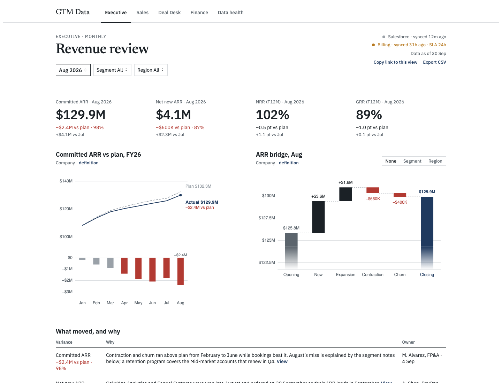
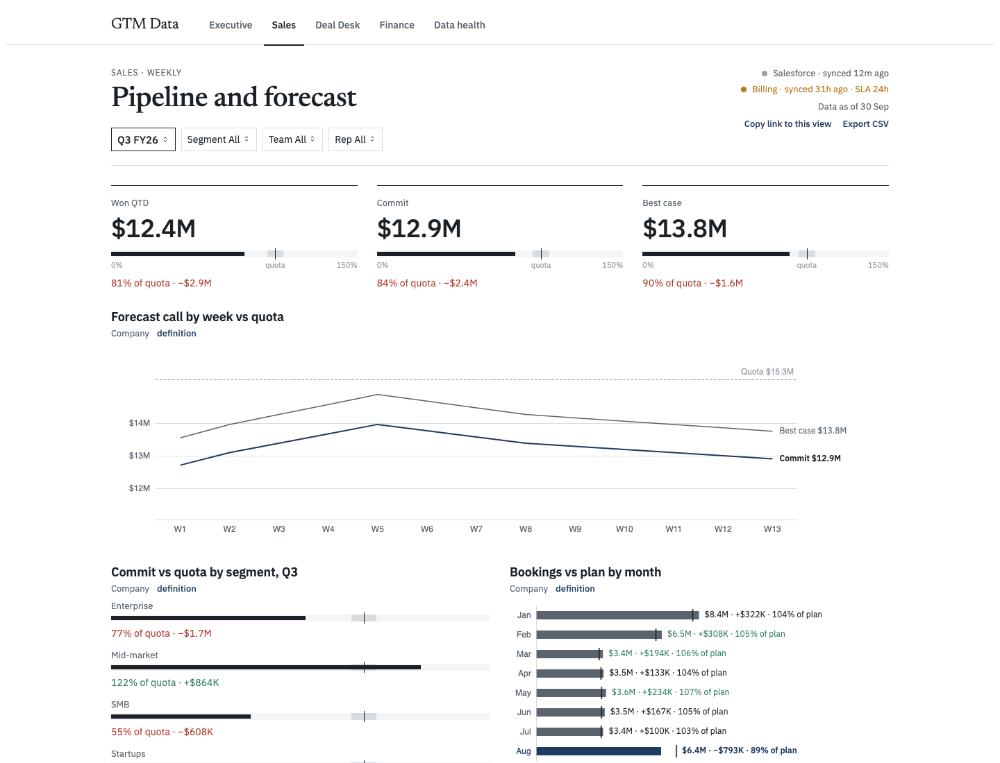
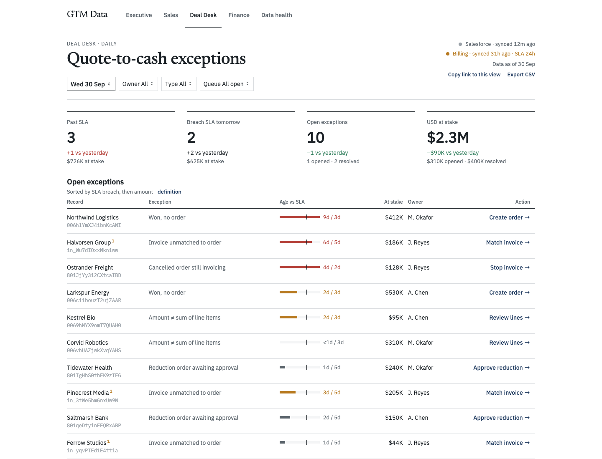
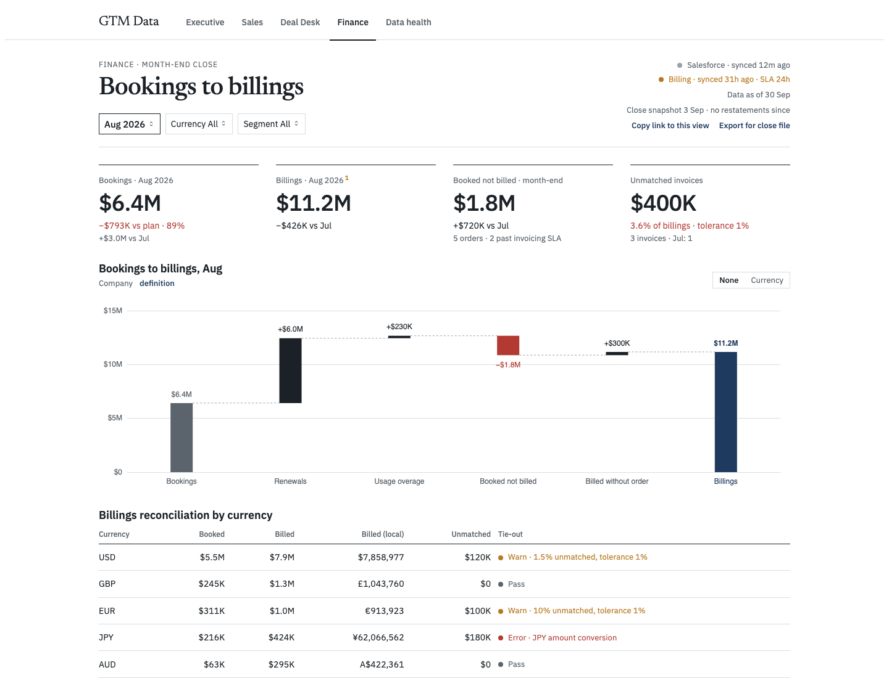
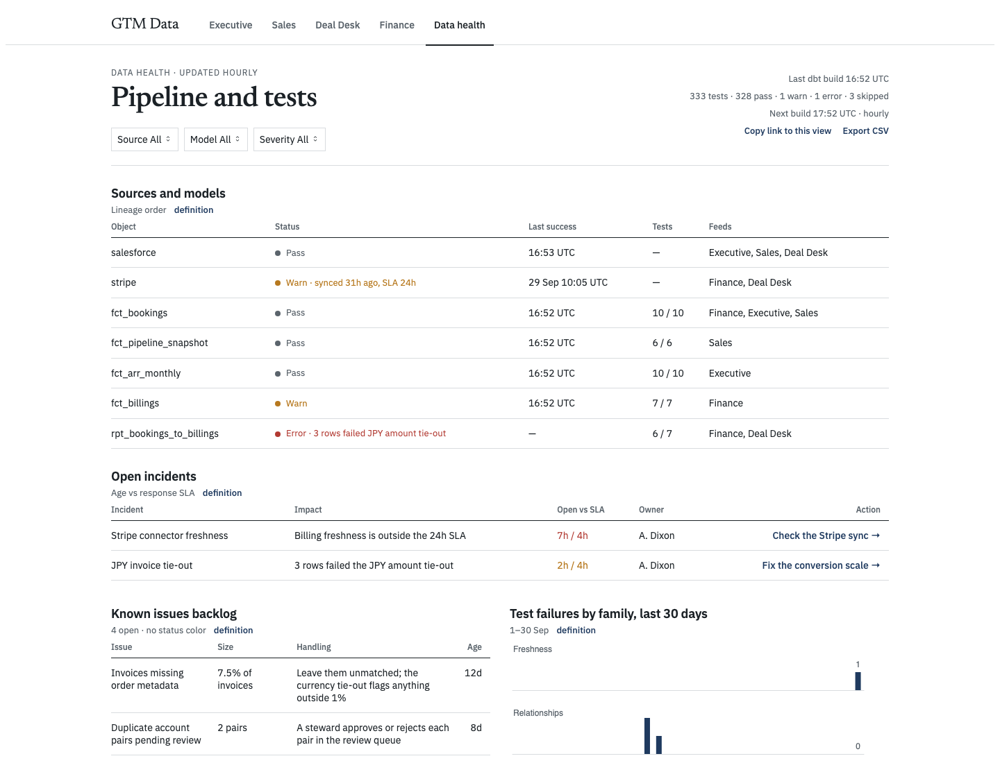

# Quote to cash

[](https://github.com/bluelight-dixon/gtm-de/actions/workflows/ci.yml)

This is a synthetic quote-to-cash warehouse and the dashboard on top of it. A generator writes a Salesforce extract and a Stripe extract, dbt-duckdb builds the models, and [Evidence](https://evidence.dev) renders five GTM pages: Executive, Sales, Deal Desk, Finance, and Data health. A few data-quality failures are planted on purpose so the health page and the finance tie-out have something real to show.

## Quickstart

Prerequisites: [uv](https://docs.astral.sh/uv/) and the DuckDB CLI.

```bash
make all
```

That generates the synthetic data, builds the dbt project, and checks source freshness. Live `make all` generates without `--as-of` and checks freshness; `make AS_OF=YYYY-MM-DD` pins the extract and skips freshness because the pin is intentionally stale.

Explore the warehouse with `make ui` (DuckDB UI), `make lab` (Jupyter in `notebooks/`), or `make docs` (dbt docs). `notebooks/00_connect.ipynb` opens the database read-only.

Explore via `gtm_explore.duckdb`; it's refreshed on every build and never locks dbt.

DuckDB allows one writer on `dbt/gtm.duckdb`. Close the UI or any other read-write session before `make build` or `make all`.

`make story-check` asserts the story contract. `make page-check` builds the dashboard and checks the five pages in a browser.

## Pages

Default slice, August 2026 closed, from the built site.











## Architecture

```
generator → staging → intermediate → facts → grouping-set rollups (rpt_*) → Evidence
```

The generator writes the extracts. Staging models are one table per source object. Intermediate models resolve accounts, FX, invoices to orders, and the quote-to-cash path. Facts (`fct_*`) are the grain of the business: ARR, bookings, billings, pipeline, aging, exceptions. The screens read grouping-set rollups (`rpt_*`): each slice of segment, region, team, or currency is already a row. Evidence pages filter those rows. Nothing is aggregated in the browser, because rates do not sum. NRR for two segments is not the sum of their NRR.

## Data quality

dbt tests cover keys, relationships, and accepted values. Source freshness has an SLA per connector: Salesforce 2 hours, Stripe 24 hours. The pinned 30 Sep 2026 extract plants one Warn and one Error, and the build records both.

- **Warn.** Stripe freshness. The last successful sync is 29 Sep 10:05 UTC, past the 24-hour SLA. Finance inherits it: billings are Warn because the upstream source is stale.
- **Error.** JPY amount tie-out on `rpt_bookings_to_billings`, 3 rows. Three invoices arrived with yen treated as if it had two decimal places.

Data health shows source and model status, the two open incidents, the known-issue backlog, and 30 days of test failures by family. Finance shows the same tie-out on the currency reconciliation: JPY is the error, and USD and EUR warn because unmatched invoices are above the 1% tolerance.

## Story contract

`docs/design/story-contract.md` is the spec the screens were drawn against.

- **Tier 1, exact.** Named records, policy, freshness, test outcomes, and every variance versus plan or quota. Plan and quota are derived from the generated actuals, so the variances hold by construction.
- **Tier 2, ±10%.** The ARR book only: monthly committed ARR, the bridge components, and Enterprise share.
- **Tier 3, invariants.** Relationships that must hold, such as the bridge tying, Won ≤ Commit ≤ Best case, and trailing-12 rates moving at most 1.5 points in a month on each segment and each region.

`make story-check` asserts those tiers and writes `docs/design/screen_numbers.json`. `make page-check` serves `dashboard/build/` statically and checks three things on all five pages: the default load shows the contract numbers, a URL-seeded first load never flashes `$0` or writes an unset-input sentinel into the address bar (polled every 100ms), and changing a dropdown re-queries that slice.

## Design rules

Titles say what the chart measures. Status color uses a materiality band, not a sign: balances within 1%, flows within 5%, rates within ±1 point, attainment within ±5 points. A chart keeps at most three labeled lines plus the baseline. Signed bridges draw the connector at the running total, so a down bar hangs from where the total stood.

## Known limitations

- Invariants are checked per single dimension (segment or region), not on combined slices. SMB · EMEA shows NRR 89% and GRR 82%. Next step: generate from a segment × region matrix and assert the bounds on every slice.
- Retention rates were calibrated against the story-check bounds, and several slices sit just under the 1.5 point monthly cap. Real data would not hug the bounds. A better generator samples from distributions and asserts the bounds instead of targeting them.
- Forecast ordering: Commit is floored at Won in `rpt_sales_attainment` (`greatest(commit, won)` on the attainment ratio). That is correct for display. The generator should produce consistent forecast categories so no floor is needed.
- Evidence tradeoff: the default slice is prerendered, and other slices query DuckDB-WASM in the browser over parquet. `make page-check` covers both.
- Not built: the drill drawer, break-down toggles (they are visible and do nothing), and top-mover interactions.
