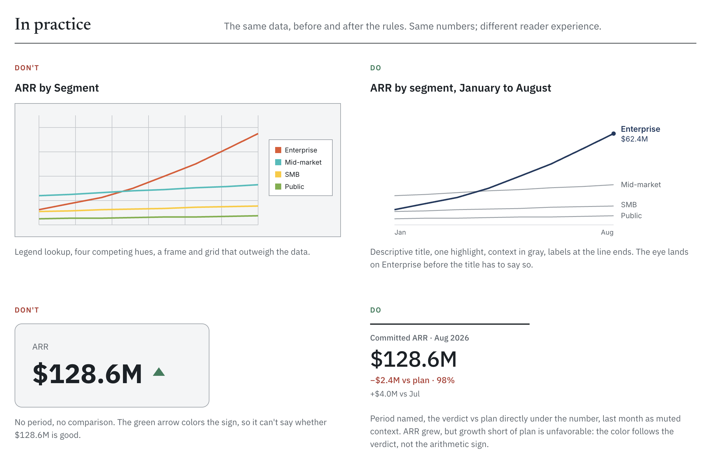
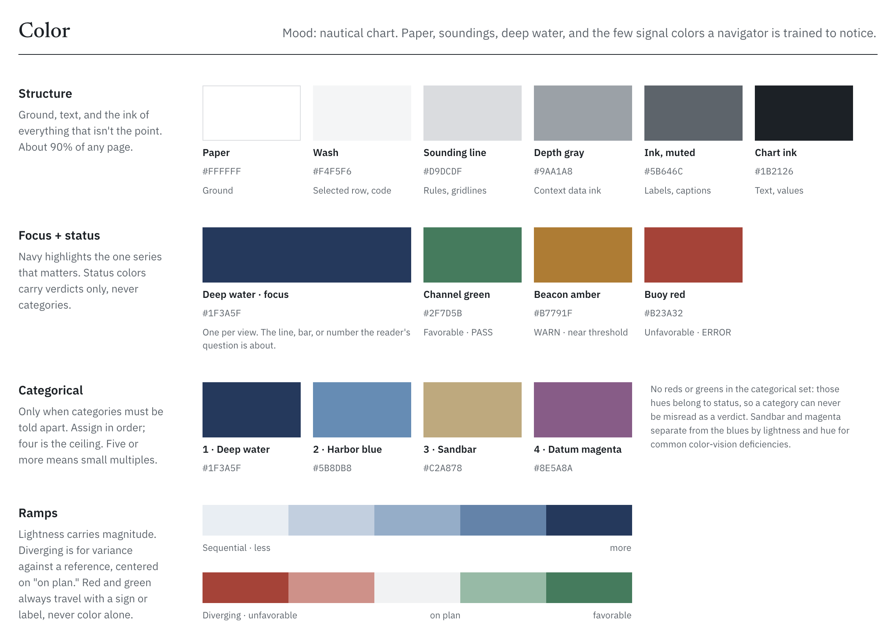
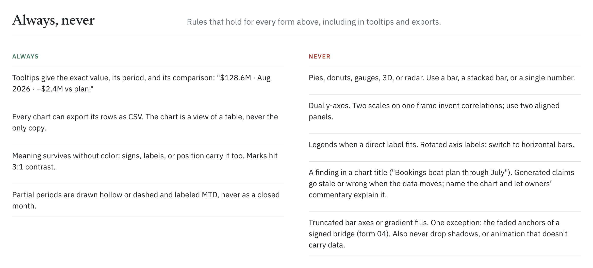
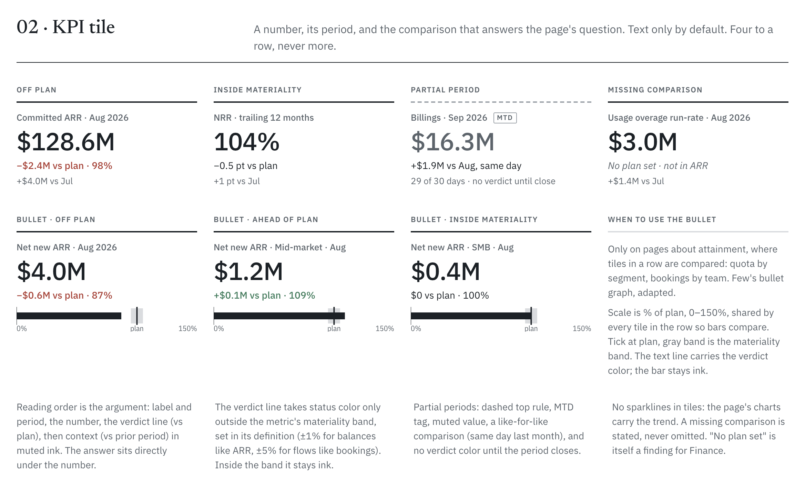
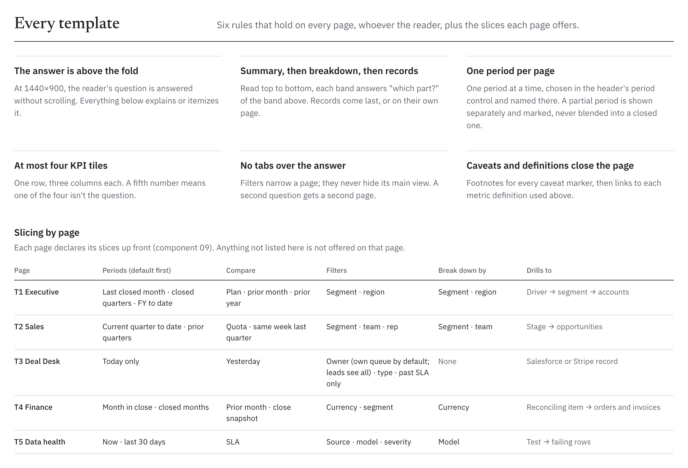
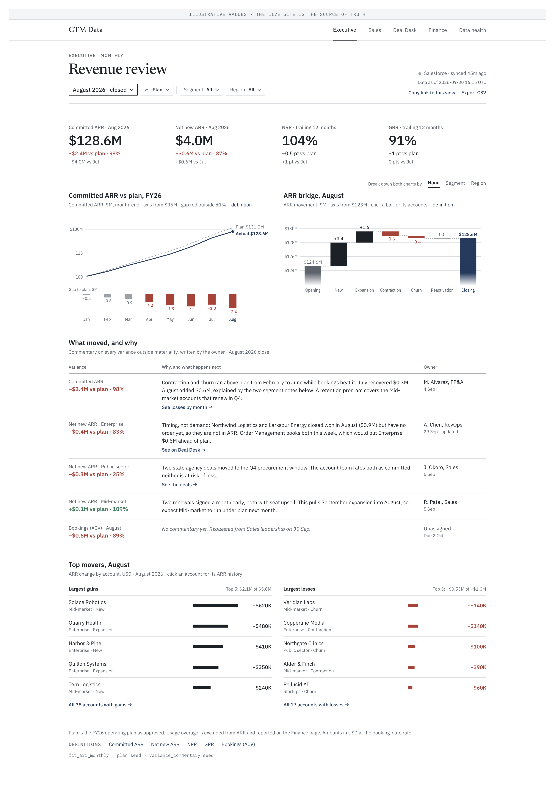

# GTM Data: quote-to-cash on synthetic Salesforce + Stripe

 · [Live dashboard](https://dixonalex.github.io/gtm-de/) · data pinned to 30 Sep 2026

Quote-to-cash reporting for a SaaS GTM team. Every number is shown against something: plan, last month, or a tolerance.

## How it's designed

Pages are organized by reader and decision, not by dataset.

| Page        | Reader                       | Cadence    | Decision                                            |
| ----------- | ---------------------------- | ---------- | --------------------------------------------------- |
| Executive   | CRO · CFO · Board            | Monthly    | Are we on plan? Why did ARR move?                   |
| Sales       | Sales leadership · RevOps    | Weekly     | Will we hit the quarter? Where is pipeline at risk? |
| Deal Desk   | Deal Desk · Order management | Daily      | What do I fix today?                                |
| Finance     | Finance · Revenue accounting | Month-end  | Do bookings, orders and billings tie out?           |
| Data health | Data team · Stewards         | Continuous | Can anyone trust these numbers today?               |

Rules you can check on the live site:

- Every number is shown against plan, prior period or a tolerance.
- Color is a verdict, never a sign: ARR that grew but missed plan is red.
- Status color appears only outside a materiality band: 1% for balances like ARR, 5% for period totals like bookings, ±1 pt for rates, ±5% for attainment.
- Titles describe the chart. Explanation lives in commentary, signed and dated by the metric's owner.
- Never pies, dual axes, legends where a direct label fits, or rotated text.

<table>
<tr>
<td width="33%" valign="top"> <b>Principles</b> The same data, before and after the rules</td>
<td width="33%" valign="top"> <b>Foundations</b> Status colors carry verdicts, never categories</td>
<td width="33%" valign="top"> <b>Chart grammar</b> Rules every chart follows</td>
</tr>
<tr>
<td valign="top"> <b>Components</b> Ten, each with its states</td>
<td valign="top"> <b>Page templates</b> Six rules every page follows</td>
<td valign="top"> <b>Applied screens</b> Designed vs built</td>
</tr>
</table>

Full system: [docs/design](docs/design/README.md) · [PDF](docs/design/design-system.pdf)

## How it's built

- Python generates synthetic Salesforce and Stripe data.
- dbt and DuckDB model it into facts and one rollup table per page. Rates are calculated in SQL so the dashboard only filters.
- The dashboard is Evidence, deployed to GitHub Pages as a static site.
- 333 dbt tests and freshness checks. Two failures are planted on purpose (stale Stripe sync, JPY tie-out) and show up on the Finance and Data health pages.
- CI checks the numbers on every page against a spec and loads each page in a headless browser, at desktop width and at 390×844 and 360×800.

## If this were going to production

This is a demo on synthetic data. Here's what I would do to take it to production.

**Start with the people**
- [ ] Interview stakeholders and rank the deliverables with RICE before building anything.
- [ ] Find out what GTM data products already exist and what needs to be built new.
- [ ] Follow the org's standards for publishing new data products.

**Correctness**
- [ ] Replace the planted test cases (like the JPY tie-out) with generic checks that work for any currency.
- [ ] Test every combination of segment and region, not just one at a time.

**Sources and pipelines**
- [ ] Real connectors with a data contract and an owner for each source table.
- [ ] Land raw files by source and load date so a backfill doesn't mean reloading everything.
- [ ] Incremental models, plus a plan for late changes like restated invoices and reopened opportunities.
- [ ] Figure out which entities need history snapshots. Opportunities for sure.

**Serving**
- [ ] A semantic layer so each metric is defined once and every tool uses the same one.
- [ ] A cloud warehouse with role-based access to rep and comp data.
- [ ] An MCP layer so people can ask Claude ad-hoc questions. Certified financial metrics, standard reports and operational dashboards stay in BI.

**Operations**
- [ ] Send freshness and test failures to the owning team's Slack channel and on-call.
- [ ] Create incidents from alerts instead of a seed file.
- [ ] Run builds on a schedule with an SLA on the pipeline itself.

**Product**
- [ ] Track which pages and charts people actually use and cut the rest.
- [ ] Master data management and writeback, so business owners can approve things like duplicate account matches themselves.

## Quickstart

You'll need [uv](https://docs.astral.sh/uv/), the DuckDB CLI, Node 22 and Chrome.

To build the same data as the live site:

    make AS_OF=2026-09-30 all

That generates the synthetic data and builds the dbt project. Leave off `AS_OF` to generate as of today, which also runs the source freshness checks.

To run the dashboard locally:

    make dash

It opens at http://localhost:3000.

To poke around the warehouse, use `make ui` for the DuckDB UI, `make lab` for Jupyter, or `make docs` for dbt docs. They all read `gtm_explore.duckdb`, a copy that's refreshed on every build so it never locks dbt.

To run the checks CI runs:

    make story-check
    make page-check

`story-check` compares the numbers against the [story contract](docs/design/story-contract.md). `page-check` builds the dashboard and loads all five pages in a browser at desktop width and at 390×844 and 360×800.

---

Built by Alex Dixon · [LinkedIn](https://www.linkedin.com/in/dixonalex) · [GitHub](https://github.com/dixonalex)

[MIT License](LICENSE)